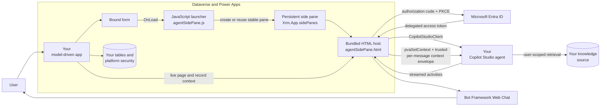
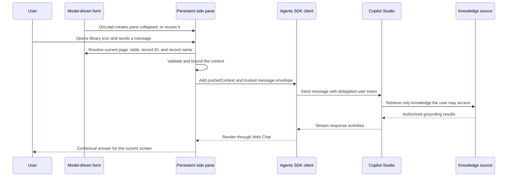

# Agent Sidecar for Model-Driven Apps

Agent Sidecar adds a persistent, context-aware Copilot Studio assistant to any Dataverse model-driven app. It appears as a collapsible side pane on the forms you choose, signs each user in with their own identity, and passes the live page and record context to your published agent — so answers are grounded in whatever screen the user is looking at.

You stand it up by importing one solution and configuring it through an in-app wizard. There is no scripting to write and nothing to build; everything happens through solution management and the administration app.

## What's new

- **🆕 Role-aware context.** The sidecar now passes the signed-in user's **Dataverse security-role names** to the agent alongside the page and record context, so the assistant can tailor its tone and guidance to who the person is. Roles ride in the same trusted per-message envelope as the rest of the context (and are also exposed as a `CurrentUserRoles` variable for topic branching), so they update on sign-in and require no Copilot Studio variable setup to take effect. Roles are treated as **context only, never authorization** — the agent's knowledge stays gated by each user's own delegated permissions, only role names are used, and no role data is logged.
- **Navigation-aware conversation.** The open pane follows the user as they move between records and forms, refreshing the agent's context without resetting the chat.
- **Per-form selection.** Choose exactly which forms get the sidecar; the **Information** form is selected by default.

## What you get

- A **persistent side pane** on the forms you select, keyed per app, that stays open and keeps its conversation as users navigate between records.
- **Live context**: the current table, record, and screen are sent to your agent before every message and updated automatically as the user moves around the app.
- **Delegated authentication** (Microsoft Entra, authorization code with PKCE): the agent answers as the signed-in user, so knowledge stays subject to that user's existing permissions. No secrets live in the browser.
- An **Agent Sidecar administration app** — a Power Apps Code App, restricted to System Administrators — that discovers your apps, tables, and forms and deploys, validates, reconciles, or removes the sidecar with automatic rollback.
- A **reference implementation** (HR Management) you can deploy if you want to see the sidecar working end to end before wiring up your own app.

## Get rolling

Everything below is done through **solution import** and the **administration app** — no command line required.

### 1. Open the interactive setup guide

[docs/setup-guide/AgentSidecarSetupGuide.html](docs/setup-guide/AgentSidecarSetupGuide.html) is a complete, click-by-click walkthrough with a live worksheet that fills your own IDs into every step (each with a one-click **Copy** button). Open it in a browser and keep it beside these steps — double-click the file, or use `open docs/setup-guide/AgentSidecarSetupGuide.html` (macOS) / `start docs\setup-guide\AgentSidecarSetupGuide.html` (Windows).

### 2. Prepare the prerequisites

- A Power Platform environment with Dataverse where you are a **System Administrator**.
- A **published Copilot Studio agent** in that environment. For a Standard harness agent, copy its **Microsoft 365 Agents SDK connection string** (Copilot Studio → your agent → Channels → Web app / Agents SDK) and note its environment ID. For a GitHub Copilot harness agent, note only its **environment ID** and **schema name**; the administration app constructs the agentic runtime URL.
- A **Microsoft Entra app registration** for the side pane's browser sign-in. Follow the dedicated [Entra app registration guide (PDF)](docs/user-guides/HR-Management-App-Guide-Entra-App-Registration.pdf) ([Word](docs/user-guides/HR-Management-App-Guide-Entra-App-Registration.docx)). In short: single-tenant **SPA**, redirect URI `https://<your-org>.crm.dynamics.com/WebResources/maftagsc_/copilot/authRedirect.html`, delegated **Power Platform API** permission `CopilotStudio.Copilots.Invoke` with **admin consent**, and **no client secret**.

### 3. Import the solution

Import **[solution-core/AgentSidecarCore.zip](solution-core/AgentSidecarCore.zip)** into your environment (Power Platform admin center, or make.powerapps.com → **Solutions → Import**). It brings the sidecar tables, web resources, and the **Agent Sidecar administration app** itself. Map any prompted connections during import.

### 4. Configure and deploy in the app

Open the **Agent Sidecar** app and run the wizard:

1. **Application** — pick the model-driven app to add the sidecar to.
2. **Tables & forms** — choose the tables; expand any table to select specific forms (the **Information** form is selected by default, others are optional).
3. **Agent** — choose Standard or GitHub Copilot harness. Standard agents require the full Agents SDK connection string and environment ID; GitHub Copilot harness agents require only the environment ID and schema name.
4. **Identity** — enter the SPA app registration's **client ID** and **tenant ID**.
5. **Review & Deploy** — deploy. The app adds the sidecar to the selected forms, publishes, and verifies the result. From the same app you can later disable, reconcile drift, or uninstall — each with live progress and a downloadable report.

### 5. Use it

Open a form in your app. The sidecar shows as a collapsed icon; expand it, sign in once, and ask questions about the current record. As users navigate, the assistant follows the record they are on.

## Reference implementation: HR Management (optional)

If you don't have a model-driven app to try this on, deploy the included **HR Management** reference. It is a complete example app — a Dataverse HR schema (benefits, time off, expenses), seven form-bound sidecars, a **HR Mgmt Classic** Copilot Studio agent, and a full knowledge library — that shows the sidecar in context. It is a demonstration, not a requirement for using the sidecar with your own app.

- Reference solution source: [solution](solution) (`HRAgentSidecar`)
- Knowledge library: [docs/entity-help](docs/entity-help) and [docs/user-guides](docs/user-guides)
- Data model and planning: [dataverse](dataverse), [CONTEXT.md](CONTEXT.md)

## Architecture

### Runtime message flow

## How the components fit together

| Component | Responsibility |
|---|---|
| **Your model-driven app** | Provides the navigation shell, Dataverse forms, authenticated Power Platform session, and current page context. Your existing app is used as-is — nothing is recreated. |
| **Form OnLoad handler** | The administration app registers a handler on each form you select, so the pane loads with that form. |
| **JavaScript launcher** | Validates the current table and record, creates or reuses one stable pane per app, and writes the live record context so the open pane can follow navigation. |
| **Persistent side pane** | Keyed per app, it starts collapsed and preserves the active conversation as the user navigates between records. |
| **HTML host and client** | Hosts Web Chat, signs the user in, creates the Agents SDK connection, keeps context current, and manages conversation reset. |
| **Microsoft Entra app registration** | Authenticates the signed-in user with authorization code + PKCE and requests only `https://api.powerplatform.com/CopilotStudio.Copilots.Invoke`. No browser client secret exists. |
| **Microsoft 365 Agents SDK** | `CopilotStudioClient` connects to your Copilot Studio environment and agent schema using the delegated user token. |
| **Your Copilot Studio agent** | Interprets the question and uses the supplied screen context to select relevant guidance from its knowledge. |
| **Agent Sidecar Core solution** | Packages the sidecar tables, web resources, and the administration app. Import it to bring the whole capability into an environment. |
| **Administration app** | The System Administrator experience for deploying, validating, reconciling, and removing sidecars. Built as a Power Apps Code App and shipped inside the Core solution. |

## Context synchronization

The pane is deliberately long-lived. Navigating to another form does not destroy and recreate it, because doing so would lose the conversation. Instead, the launcher writes the authoritative form context on every navigation and the pane reads it immediately before every message — and pushes an update into the live conversation the moment the record or screen changes.

The context includes:

| Value | Source | Use |
|---|---|---|
| `pageType` | Host page context | Distinguishes record, list, and other supported pages. |
| `entityName` | Current form context | Routes the request to the matching screen. |
| `recordId` | Current form context | Identifies the current record without treating the identifier as knowledge. |
| `recordName` | Matching form primary attribute | Gives the user a friendly orientation after table and record ID are verified. |
| `appId` | Current app properties | Confirms the model-driven app context when available. |

Two mechanisms deliver that context to the agent:

1. A `pvaSetContext` event updates Copilot Studio conversation variables (also pushed proactively on navigation).
2. A trusted, bounded context envelope accompanies every outbound user message.

The primary record name is accepted only when the form's table and normalized record ID match the current page context, so a record name from the previously viewed screen never leaks into the next question.

Selecting **New conversation** closes the current Agents SDK connection, clears the local transcript, resolves the page open at that moment, and creates a fresh conversation without forcing another sign-in.

## Authentication and authorization

The side pane preserves the user's identity end to end:

1. The browser signs the user in through Microsoft Entra ID.
2. It requests only the delegated Copilot Studio invoke scope.
3. `CopilotStudioClient` sends the delegated token to Copilot Studio.
4. The agent accesses its knowledge as that user, so the user's existing permissions remain authoritative.
5. Any live Dataverse reads remain subject to table, row, and field security.

Access tokens are handled by MSAL and are not written to URLs, logs, source files, or solution configuration. Application ID, tenant ID, environment ID, and agent schema name are identifiers, not secrets.

### Microsoft Entra app registration

The side pane cannot reach the Copilot Studio agent until its browser application is registered correctly. Use the dedicated guide rather than a generic app-registration walkthrough:

- [Published PDF guide](docs/user-guides/HR-Management-App-Guide-Entra-App-Registration.pdf)
- [Editable Word guide](docs/user-guides/HR-Management-App-Guide-Entra-App-Registration.docx)

The guide covers the settings that make the delegated Agents SDK connection work:

1. Register the browser client as a single-tenant **Single-page application (SPA)**.
2. Add the exact redirect URI: `https://<your-org>.crm.dynamics.com/WebResources/maftagsc_/copilot/authRedirect.html`.
3. Add the delegated **Power Platform API** permission `CopilotStudio.Copilots.Invoke`.
4. Grant tenant admin consent for that delegated permission.
5. Copy the non-secret Application ID and tenant ID into the wizard's Identity step.
6. Leave **Certificates & secrets** empty — the browser uses authorization code with PKCE and must never receive a client secret.

The guide also includes a configuration worksheet, validation checklist, and troubleshooting for redirect URI, consent, and agent-connection failures.

## Architecture decisions

- [Separate model-driven solution](docs/adr/0001-use-separate-model-driven-hr-solution.md)
- [Delegated authentication and Microsoft 365 Agents SDK](docs/adr/0003-use-delegated-agents-sdk-for-authenticated-side-pane.md)
- [Reusable core and target binding product architecture](docs/adr/0004-productize-sidecar-as-core-and-target-bindings.md)
- [Code App administration architecture](docs/adr/0005-use-code-app-for-sidecar-administration.md)

## Reference data model (HR Management)

The HR Management reference prefers out-of-the-box Dataverse capabilities before introducing custom schema.

**Reused platform tables** — Employee → `systemuser`, Position → `position`, Department → `businessunit`, plus platform ownership, currency, state/status, and audit columns.

**Custom tables** — Benefit Plan, Benefit Enrollment, Time Off Type, Time Off Balance, Time Off Request, Expense Report, and Expense Line.

The planning source is [dataverse/planning-payload.json](dataverse/planning-payload.json), the reuse analysis is [dataverse/hr-oob-discovery.md](dataverse/hr-oob-discovery.md), and business terminology is in [CONTEXT.md](CONTEXT.md).

## Knowledge and help content (reference)

The HR Management reference ships a full knowledge library that shows how to ground the agent:

- [docs/entity-help](docs/entity-help) — screen-specific help for each business entity, as agent-ready Markdown, editable Word, and published PDF.
- [docs/user-guides](docs/user-guides) — end-to-end process guidance for employee and organization data, time off, expenses, and benefits.

[docs/entity-help/entity-help-manifest.json](docs/entity-help/entity-help-manifest.json) maps a Dataverse table name to the matching topic; the current page's `entityName` is the routing key. Your own agent's knowledge and any SharePoint or Copilot Studio knowledge sources are configured in your environment, not in this solution.

## Repository map

| Path | Contents |
|---|---|
| [solution-core/AgentSidecarCore.zip](solution-core/AgentSidecarCore.zip) | The importable Agent Sidecar Core solution — the capability you deploy. |
| [docs/setup-guide](docs/setup-guide) | Interactive, click-by-click setup guide with a values worksheet. |
| [docs/user-guides](docs/user-guides) | Microsoft Entra app-registration guide and reference process guides. |
| [docs/adr](docs/adr) | Architecture Decision Records. |
| [src](src) | Source for the Agent Sidecar administration app (Power Apps Code App). |
| [model-driven](model-driven) | Source for the side-pane runtime web resources. |
| [solution](solution) | HR Management reference solution source (`HRAgentSidecar`). |
| [dataverse](dataverse) | Reference data model, planning payload, and discovery notes. |

## Building from source

Using the sidecar needs nothing beyond the setup steps above. Contributors who want to modify the administration app or the side-pane runtime will find build and test notes in [model-driven/README.md](model-driven/README.md) and [HANDOFF.md](HANDOFF.md).

## Design principles

- One stable pane per app, so navigation never creates duplicate conversations.
- Refresh context on every navigation and before every message, instead of trusting launch-time context.
- Treat record IDs as pointers, never as authorization or knowledge content.
- Preserve delegated identity end to end; the agent answers as the signed-in user and stays within their permissions.
- Never include unrelated business data, tokens, or connector payloads in prompts or logs.
- Deploy, update, and remove sidecars through the administration app so form changes are always published and verified.
